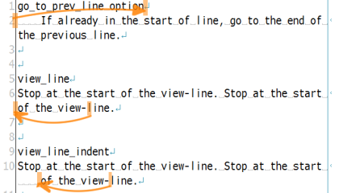

my-mery-util
============

My Mery utilities.
All of files are released under [the MIT License](http://opensource.org/licenses/mit-license.php).
So you can use them freely.

[Mery](http://www.haijin-boys.com/wiki/%E3%83%A1%E3%82%A4%E3%83%B3%E3%83%9A%E3%83%BC%E3%82%B8)
is simple and powerful text editor for Windows written by [Kuro](https://github.com/haijinboys).

自分用のMeryユーティリティです。
すべて[MITライセンス](http://opensource.org/licenses/mit-license.php)で配布されます。
なので自由にご利用いただけます。

[Mery](http://www.haijin-boys.com/wiki/%E3%83%A1%E3%82%A4%E3%83%B3%E3%83%9A%E3%83%BC%E3%82%B8)
は [Kuro](https://github.com/haijinboys) 氏によるWindows用のシンプルで多機能なテキストエディタです。

toStart.js
---------------
Go to the start of line.

行頭に移動します。

### options
| option            | If true then |
|-------------------|--------------|
| go_prev_line      | If already in the start of line, go to the end of the previous line. |
| view_line         | Stop at the start of the view-line. |
| view_line_indent  | Stop at the end of indents of the view-line. |

### オプション
| オプション        | true のとき  |
|-------------------|--------------|
| go_prev_line      | すでに行頭にいた場合、前の行の行末へ移動する |
| view_line         | 折り返し行（表示行）の先頭で止まる |
| view_line_indent  | 折り返し行（表示行）のインデントの場所で止まる |

toEnd.js
---------------
Go to the end of line. If already in the end of line, go to the end of next line.

行末に移動します。すでに行末だった場合は、次の行の行末に移動します。

NLauncher.js
---------------

It is a launcher macro that opens URL or file or explorer etc. by selected text. 
If no text is select, it reads the word around the caret.

選択した文字列からURLやファイルやエクスプローラを開いたりできるランチャマクロです。
文字列を選択していなくても、付近の単語などを読み取ります。

### Require / 必要なファイル
- FileSystemObject.js
- String.js
- Selector.js
- Launcher.js
- MenuBuilder.js
- [ShowPopupMenu.js](http://www.haijin-boys.com/wiki/%E3%83%9D%E3%83%83%E3%83%97%E3%82%A2%E3%83%83%E3%83%97%E3%83%A1%E3%83%8B%E3%83%A5%E3%83%BC%E3%82%92%E6%89%8B%E8%BB%BD%E3%81%AB%E6%89%B1%E3%81%86)

### Feature / 機能
- open as URL / URLを開く
- as Path / パスとして処理する
  - open in Mery / Meryで開く
  - open in associated program / 関連付けされたプログラムで開く
  - open in explorer / エクスプローラで開く
  - open in command prompt / コマンドプロンプトで開く
  - open parent folder in explorer / 親フォルダをエクスプローラで開く
  - open parent folder in command prompt / 親フォルダをコマンドプロンプトで開く
  - create file or folder / ファイルもしくはフォルダを作る
  - create parent folder / 親フォルダを作る
- as String / 文字列として処理する
  - search forward or backforward / 前もしくは後ろへ検索する
  - search in Google / Googleで検索する
  - translate in GoogleTranslate / Google翻訳で翻訳する
  - search in Wikipedia / Wikipediaで検索する

GFMtoHTML.js
---------------

Convert currently GFM (GitHub Flavored Markdown) to HTML with [GitHub Markdown API](
https://developer.github.com/v3/markdown/).

現在開いているGFM(GitHub Flavored Markdown)ファイルをHTMLファイルに変換します。

### Installation
1. Get [gfm-wsh](https://github.com/noonworks/gfm-wsh) files.
2. Copy `gfm.js` `gfm_header.html` `gfm_footer.html` `github.css` to Mery macro directory.
3. Copy `GFMtoHTML.js` to Mery macro directory.
4. Open Mery and [マクロ] - [選択] and select `GFMtoHTML.js`.

### Personal access token
If you have a 'Personal access token' for GitHub API,
set it to variable `access_token` in `GFMtoHTML.js`.
You can get Personal access tokens on [GitHub Setting page](
https://github.com/settings/applications).

* If you set the token, you can use API 5,000 times per hour.
* If not, 60 times per hour.

### インストール
1. [gfm-wsh](https://github.com/noonworks/gfm-wsh) のファイルをダウンロードします。
2. `gfm.js` `gfm_header.html` `gfm_footer.html` `github.css` をMeryのマクロフォルダにコピーします。
3. `GFMtoHTML.js` をMeryのマクロフォルダにコピーします。
4. Meryを開き、[マクロ] - [選択] から `GFMtoHTML.js` を選択します。

### トークン
GitHub APIの'Personal access token'がある場合は、`GFMtoHTML.js`の`access_token`変数に設定してください。
Personal access tokensは[GitHub設定ページ](https://github.com/settings/applications)で
取得できます。

* トークンを設定した場合、1時間に5,000回のAPIが使用できます。
* 設定しなかった場合は、1時間に60回のAPIが使用できます。
